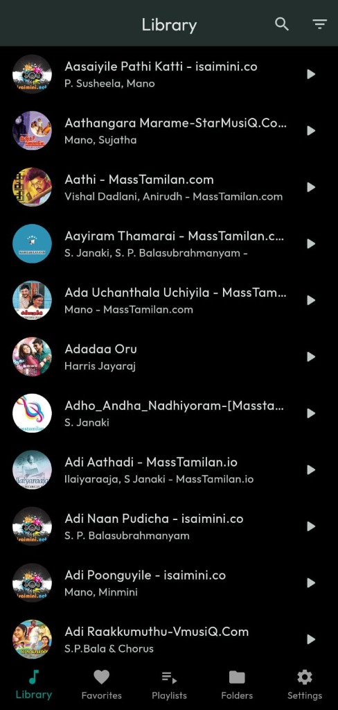
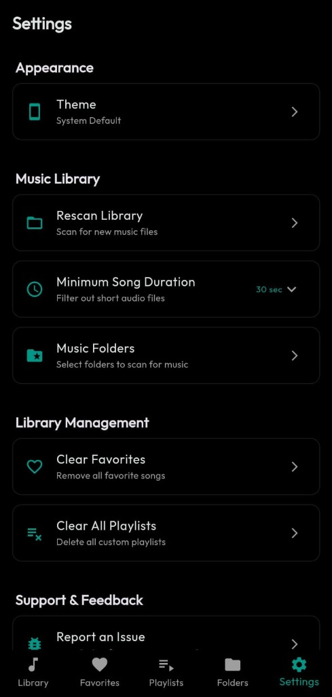

# 🎵 Isai - Offline Music Player

A feature-rich offline music player application built with Flutter. Enjoy your local music library with a beautiful, modern interface.

> 💡 **Concept & Ideas**: Designed and envisioned by **Vinoth**
> 
> 🤖 **Technical Implementation**: Built and debugged with **Google's Gemini AI (Antigravity)**

---

## 📸 Screenshots

<p align="center">
  
  
  
</p>

| Library | Now Playing | Settings |
|---------|-------------|----------|
| Browse all your songs | Full playback controls | Customize your experience |

---

## ✨ Features

### 🎵 Music Playback
- **Offline Playback** - Play local audio files directly from your device
- **Background Playback** - Continue listening while using other apps
- **Lock Screen Controls** - Control playback from notification and lock screen
- **Shuffle & Repeat** - Multiple playback modes

### 📚 Library Management
- **Library Screen** - Browse all songs with album artwork
- **Favorites** - Mark songs as favorites with quick access and **Play All** button
- **Playlists** - Create and manage custom playlists
- **Folders** - Browse music organized by folders
- **Search & Filter** - Quickly find your favorite tracks

### ⚙️ Settings & Customization
- **Theme Support** - Light, Dark, and System default themes
- **Music Folders** - Select which folders to scan (exclude call recordings!)
- **Minimum Duration Filter** - Filter out short audio files (30s to 5min)
- **Rescan Library** - Refresh your music library anytime

### 🎨 Beautiful UI
- Modern, clean interface with smooth animations
- Album artwork display
- Responsive design for all screen sizes

---

## 🛠️ Tech Stack

| Technology | Purpose |
|------------|---------|
| [Flutter](https://flutter.dev/) | Cross-platform framework |
| [Dart](https://dart.dev/) | Programming language |
| [Provider](https://pub.dev/packages/provider) | State management |
| [just_audio](https://pub.dev/packages/just_audio) | Audio playback engine |
| [audio_service](https://pub.dev/packages/audio_service) | Background audio & notifications |
| [on_audio_query](https://pub.dev/packages/on_audio_query) | Query device music library |
| [shared_preferences](https://pub.dev/packages/shared_preferences) | Local storage |

---

## 🚀 Getting Started

### Prerequisites

- [Flutter SDK](https://docs.flutter.dev/get-started/install) (3.0+)
- [Android Studio](https://developer.android.com/studio) or [VS Code](https://code.visualstudio.com/)

### Installation

```bash
# Clone the repository
git clone https://github.com/Vinoth-46/Music_player.git
cd Music_player

# Install dependencies
flutter pub get

# Run the app
flutter run
```

---

## 📦 Building for Release

```bash
# Generate release APK
flutter build apk --release

# APK location
# build/app/outputs/flutter-apk/app-release.apk
```

---

## 📱 App Screens

| Screen | Description |
|--------|-------------|
| **Library** | Browse all songs alphabetically with artwork |
| **Favorites** | Quick access to your favorite songs |
| **Playlists** | Create and manage custom playlists |
| **Folders** | Browse music organized by device folders |
| **Settings** | Theme, folder selection, duration filter |
| **Now Playing** | Full player with artwork and controls |

---

## 🤝 Contributing

Contributions are welcome! Please feel free to submit a Pull Request.

---

## 👨‍💻 Developer

**Vinoth** - Flutter Developer

[](https://github.com/Vinoth-46)
[](https://www.linkedin.com/in/vinoth465/)

---

## 📄 License

This project is licensed under the MIT License - see the [LICENSE](LICENSE) file for details.

---

<p align="center">Made with ❤️ by Vinoth | Powered by 🤖 Gemini AI</p>
